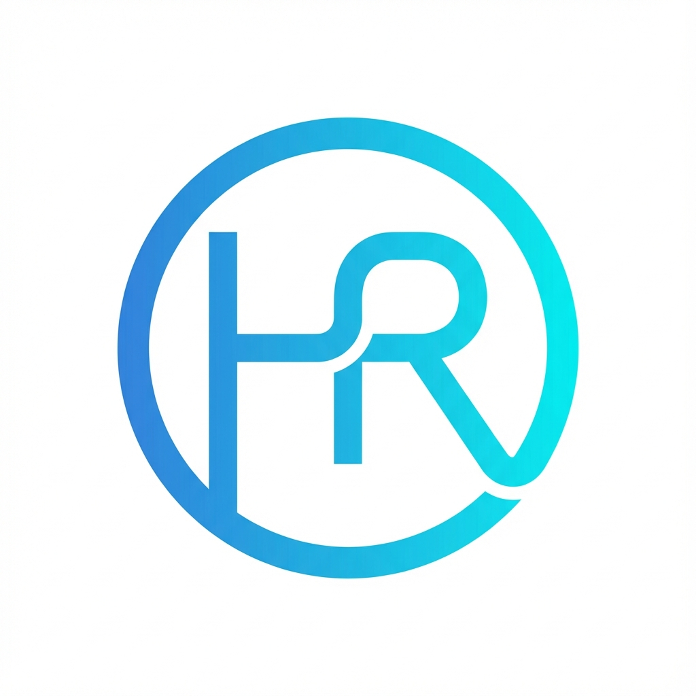

<div align="center">
  <br />
    <a href="https://hemachand-ravulapalli.com" target="_blank">
      
    </a>
  <br />

  <h1 align="center">Developer Portfolio</h1>

  <div align="center">
    
    
    
    
  </div>

  <h3 align="center">A high-performance, cinematic portfolio built for the modern web.</h3>

  <p align="center">
    <b>
      <a href="https://github.com/HemachandRavulapalli/web2-portfolio">View Repo</a> • 
      <a href="https://github.com/HemachandRavulapalli/web2-portfolio/issues">Report Bug</a> • 
      <a href="https://github.com/HemachandRavulapalli/web2-portfolio/pulls">Request Feature</a>
    </b>
  </p>
</div>

---

## 🚀 Overview

This is a **Minimalist Interactive Portfolio** designed to showcase technical skills and projects with cinematic flair. It features a custom **Mesh Gradient** engine for light mode, a **Celestial Night** system for dark mode, and fully responsive, accessible UI components.

## ✨ Key Features

- **🎨 Dynamic Theme System**:
    - **Light Mode**: Interactive "Spotlight" Mesh Gradient (Cyan/Purple/Blue).
    - **Dark Mode**: Atmospheric Celestial Background (Moon, Stars, Meteor Showers).
- **⚡ Performance First**:
    - Built with **Vite** for instant HMR and optimized builds.
    - **Tailwind v4** for zero-runtime CSS.
    - **Framer Motion** for hardware-accelerated 60fps animations.
    - No heavy 3D libraries (Three.js removed for performance).
- **📱 Responsive & Accessible**:
    - Mobile-first approach with `touch` optimized navigation.
    - Respects `prefers-reduced-motion` for accessibility.
    - Semantic HTML5 structure.

## 🛠️ Tech Stack

| Core | Styling | Animation | Tooling |
| :--- | :--- | :--- | :--- |
| **React 18** | **Tailwind CSS v4** | **Framer Motion** | **Vite** |
| Javascript (ES6+) | CSS Variables | SVG Filters | ESLint |
| Lucide React | PostCSS | CSS Modules | Git |

## 📦 Getting Started

### Prerequisites

- **Node.js** (v16+)
- **npm** or **yarn**

### Installation

1. **Clone the repository**
   ```bash
   git clone https://github.com/HemachandRavulapalli/web2-portfolio.git
   cd web2-portfolio
   ```

2. **Install Dependencies**
   ```bash
   npm install
   ```

3. **Run Development Server**
   ```bash
   npm run dev
   ```
   Open [http://localhost:5173](http://localhost:5173) to view it in the browser.

## 🚀 Building for Production

```bash
npm run build
```
The output will be in the `dist/` folder, ready for deployment to Vercel, Netlify, or AWS.

## 📂 Project Structure

```
src/
├── components/          # React Components
│   ├── background/      # Light/Dark Background Systems
│   ├── Navbar.jsx       # Responsive Navigation
│   ├── Hero.jsx         # Introduction Section
│   ├── Skills.jsx       # Tech Stack Badges
│   └── ...
├── context/             # React Context (Theme, State)
├── hooks/               # Custom Hooks (useReducedMotion, etc.)
├── index.css            # Tailwind Imports & Global Styles
└── main.jsx             # Entry Point
```

## 🤝 Contributing

Contributions are what make the open source community such an amazing place to learn, inspire, and create. Any contributions you make are **greatly appreciated**.

1. Fork the Project
2. Create your Feature Branch (`git checkout -b feature/AmazingFeature`)
3. Commit your Changes (`git commit -m 'Add some AmazingFeature'`)
4. Push to the Branch (`git push origin feature/AmazingFeature`)
5. Open a Pull Request

## 📄 License

Distributed under the MIT License. See `LICENSE` for more information.

---

<div align="center">
  <p>&copy; 2025 Hemachand Ravulapalli. All rights reserved.</p>
</div>
